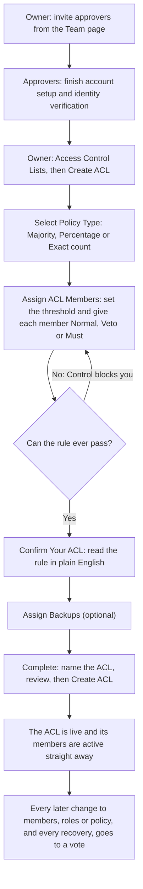
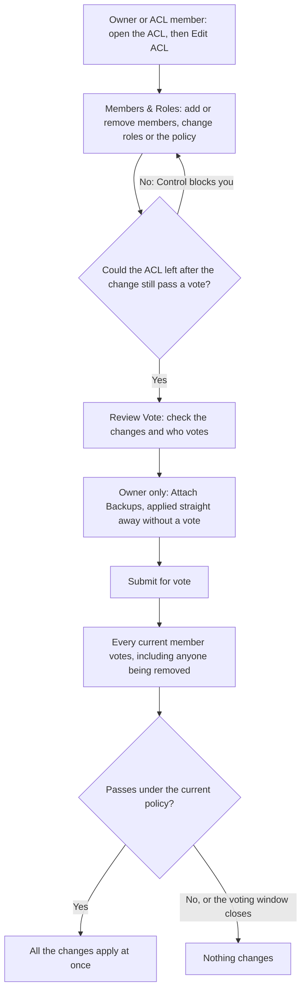

An Access Control List (ACL) is the group of named people authorised to approve the recovery of the backups it protects, and to approve any change to who is on the list. You decide how many of them must agree by choosing an **approval policy** when you create the ACL. The members can vote to change it later.

Changing who's on an ACL, what role each member has, or its approval policy isn't an administrative action. The people already on the list vote on it, under the ACL's current policy. That's what ensures nobody outside the list, whether one of your own administrators or CoinCover, can quietly change who is able to release your material.

## At a glance

|  |  |
| --- | --- |
| **Scope** | One ACL can protect many backups. Each backup is protected by one ACL. |
| **Approval policy** | **Majority**, **Percentage** or **Exact count**, chosen when you create the ACL. Changing it later needs a vote. |
| **Member roles** | **Normal**, **Veto** or **Must approve**. A member can be both Veto and Must approve. |
| **Minimum size** | One member, as long as the policy can always be met by the members you add |
| **Who creates an ACL** | An Organisation Owner |
| **Who can propose a change** | An Organisation Owner or a member of the ACL, with **Edit ACL** |
| **Who approves a change or a recovery** | The ACL's members, under its current policy. Members being removed vote too. |
| **What doesn't need a vote** | Renaming the ACL, and attaching more backups to it. Only an Organisation Owner can do either. |
| **Voting window** | Set for your organisation. Seven days by default. |
| **Verification of Vote** | Each member's identity is verified at the point of voting, with an optional hardware security key for added assurance. |

## Approval policies

The policy sets the **threshold**: how many approvals a vote needs. It applies to every vote the ACL holds, both recovery requests for its backups and changes to its own membership.

| Policy | How the threshold is worked out | 3 members | 4 members | 5 members |
| --- | --- | --- | --- | --- |
| **Majority** | More than half of the members | 2 | 3 | 3 |
| **Percentage** (example: 60%) | That share of the members, always rounded up | 2 | 3 | 3 |
| **Exact count** (example: 2) | The number you set, however many members there are | 2 | 2 | 2 |

Some worked examples:

- **Majority with 4 members** needs 3 approvals. Half of 4 is 2, and the policy needs more than half.
- **Percentage at 51% with 4 members** needs 3 approvals. 51% of 4 is 2.04, which rounds up to 3.
- **Percentage at 75% with 6 members** needs 5 approvals. 75% of 6 is 4.5, which rounds up to 5.
- **Percentage at 10% with 5 members** needs 1 approval. Any percentage always needs at least one, and Control warns you when your percentage rounds down to a one-person rule.
- **Exact count of 2 with 5 members** needs 2 approvals. If the ACL later grows to 8 members, it still needs 2.

<Note>
  Majority and Percentage thresholds follow the ACL's current size. If members are added or removed later, the number of approvals needed changes with them. An Exact count threshold stays the same.
</Note>

### Rejections use the same threshold

A vote is declined as soon as the number of rejections reaches the threshold. With an **Exact count of 2 out of 5**, two rejections decline the request, even if the other three members would have approved. A low threshold makes approval easy, and it makes rejection just as easy.

If everyone who can vote has voted and neither approvals nor rejections reached the threshold, the request is declined.

## Member roles

Each member has one of these roles, chosen as you add them:

| Role | What it means |
| --- | --- |
| **Normal** | Their vote counts toward the threshold like everyone else's. |
| **Veto** | Their rejection declines the request on its own, whatever anyone else has voted. Their approval counts toward the threshold like a Normal member's. |
| **Must approve** | The request can't be approved without their approval, even when the threshold is met. Their approval also counts toward the threshold. |

A member can be both **Veto** and **Must approve**. Their rejection declines the request straight away, and nothing passes without their approval.

### How the outcome is decided

Control checks a vote in this order every time someone votes:

1. **Voting window.** If the window has closed, the request expires and nothing is applied, whatever votes came in.
2. **Veto.** If any Veto member has rejected, the request is declined straight away. This applies even if a Must-approve member has approved.
3. **Threshold.** If approvals reach the threshold, the request is approved, subject to step 4. If rejections reach the threshold, it's declined. If everyone has voted and neither side reached it, it's declined.
4. **Must approve.** If the threshold is met but a Must-approve member hasn't approved yet, the request stays open for them. If a Must-approve member rejected, the request can't pass, and it's declined once everyone has voted or when the window closes.

A vote only counts once that member's verification has been completed.

#### Worked example

An ACL of five members uses **Majority**, so it needs 3 approvals. Alex is **Must approve** and Bea is **Veto**. Chris, Dana and Eli are **Normal**.

| What happens | Outcome |
| --- | --- |
| Chris, Dana and Eli approve | Threshold met, but Alex hasn't approved. The request stays open. |
| ...then Alex approves | **Approved** |
| Alex and Chris approve, then Bea rejects | **Declined** straight away. Bea vetoed it. |
| Alex rejects; Chris, Dana and Eli approve | Can't pass without Alex. **Declined** once Bea has voted too, or when the window closes. |
| Chris and Dana reject | Still open: 2 rejections is below the threshold of 3. |
| Chris, Dana and Eli reject | **Declined**. Rejections reached the threshold. |

## Create an ACL

Here is the whole setup, from inviting approvers to the first vote. Every step is done by your organisation. CoinCover doesn't take part in creating an ACL.

<Steps>
  <Step title="Onboard your approvers">
    Everyone you want on the ACL first needs a Control account. Invite them from the **Team** page and have them complete account setup and identity verification. Only active users of your organisation can be added to an ACL, and members need a completed identity check before they can vote.
  </Step>
  <Step title="Start creating the ACL">
    As an Organisation Owner, go to **Access Control Lists** and select **Create ACL**.
  </Step>
  <Step title="Select a policy type">
    On **Select Policy Type**, choose **Majority**, **Percentage** or **Exact count**. See [Approval policies](#approval-policies) for how each one works.
  </Step>
  <Step title="Assign members and roles">
    On **Assign ACL Members**, set the threshold if your policy needs one: the percentage for **Percentage**, or the number of approvals for **Exact count**. Then add each member by choosing their role: **Normal**, **Veto** or **Must**. Choosing a role adds the person. Selecting **Normal** again on a Normal member takes them off the list.

    The panel beside the list shows **The rule, in plain English**, for example "At least 3 of 5 members must approve", and names each Veto and Must-approve member. You can't continue while the rule could never pass. For example, an Exact count of 4 with only 3 members is blocked.
  </Step>
  <Step title="Confirm the rule">
    On **Confirm Your ACL**, check the rule reads the way you intend, then select **Confirm & continue**. Control points out anything worth a second look, such as Must-approve members who already decide every outcome on their own, or a percentage that rounds down to a single approval.
  </Step>
  <Step title="Assign backups">
    On **Assign Backups**, choose the backups this ACL protects. Recovering any of them will need this policy. Backups that already have an ACL show as **Already assigned** and can't be selected. This step is optional: you can assign backups later.
  </Step>
  <Step title="Name, review and create">
    On **Complete**, check the name under **Name this ACL**. Control fills in a name that describes the policy, such as "Majority ACL, 5 members". You can change it, but you can't leave it blank. Review the members and backups, then select **Create ACL**. The members you added are active straight away. No vote is needed to set up the list.
  </Step>
</Steps>

## Change an ACL

Once the ACL exists, you change it with **Edit ACL** on the ACL's page. In one go you can add and remove members, change members' roles, change the approval policy, and attach more backups. Everything except the backups goes to a single vote of the current members, under the ACL's current policy.

<Steps>
  <Step title="Open the wizard">
    Open the ACL from **Access Control Lists** and select **Edit ACL**. An Organisation Owner or any member of the ACL can do this. If **Edit ACL** isn't available, its tooltip says why, for example because a vote is already open or a recovery is in progress on one of the ACL's backups.
  </Step>
  <Step title="Change members, roles and the policy">
    On **Members & Roles**, search for someone to add and pick their role, remove members, or change a member's role between **Normal**, **Veto** and **Must approve**. You can also change the policy type or its threshold. Each row shows whether that person is being added, being removed, or having their role changed.

    As in the Create ACL wizard, you can't continue if the ACL left after the change could never pass a vote. For example, you can't set an Exact count of 4 while only 3 members would remain.
  </Step>
  <Step title="Review the vote">
    On **Review Vote**, check **Your changes** and the before and after view of the policy. The page lists who votes and the rule the vote passes under. If someone being removed is a **Veto** or **Must approve** member, Control points out that they can block their own removal.
  </Step>
  <Step title="Attach backups (Organisation Owners only)">
    On **Attach Backups**, choose any more backups this ACL should protect. Backups are attached as soon as you submit, without a vote. A backup that's already protected by another ACL can't be moved to this one, and a backup can't be taken off an ACL once it's attached.
  </Step>
  <Step title="Submit">
    Select **Submit for vote**. Everyone currently on the ACL is asked to approve or reject the change as a whole. If you only attached backups, nothing goes to a vote.
  </Step>
  <Step title="The change takes effect">
    If the vote passes under the ACL's current policy, all the changes apply together. If it's declined, or the voting window closes first, nothing changes. A new policy applies to votes after the change, not to the vote that approves it. See [Approve or reject an ACL change](/guides/control/approve-list-change) for the voter's side.
  </Step>
</Steps>

### Who votes on a change

Every current member votes, including anyone the change would remove. People being added don't vote, because they aren't members yet.

- A **Veto** member can veto their own removal.
- A **Must approve** member has to approve their own removal, or the change can't pass.

The same applies to a change that takes away their Veto or Must approve role.

For example, on a **Majority** ACL of four members (3 approvals needed), a change that removes one member is voted on by all four, and still needs 3 approvals.

### Rename an ACL

Organisation Owners can rename an ACL at any time. On the ACL's page, select its name, enter the new name in **Rename ACL** and save. Renaming doesn't go to a vote, and it doesn't change who can approve anything.

## Good to know

- **One change at a time.** A change can include many edits, but only one can be open for voting on an ACL. Wait for it to finish, or cancel it, before making another.
- **ACLs are frozen during a recovery.** An ACL can't be edited while a recovery is running on one of its backups, and a recovery can't be started while a change to its ACL is in progress. Plan membership changes outside recovery windows.
- **Remove people from the ACL before the organisation.** Control won't remove a person from your organisation while they're still on any Access Control List, so take them off their ACLs first.

## What's next

<CardGroup cols={2}>
  <Card title="Approve or reject an ACL change" icon="user-check" href="/guides/control/approve-list-change">
    The voter's side of a change to an ACL.
  </Card>

  <Card title="Recover key material" icon="key" href="/guides/control/recover-key-material">
    Use the ACL to approve a recovery.
  </Card>

  <Card title="Get started" icon="circle-play" href="/guides/control/get-started">
    Onboard the people who'll be on your ACLs.
  </Card>
</CardGroup>
