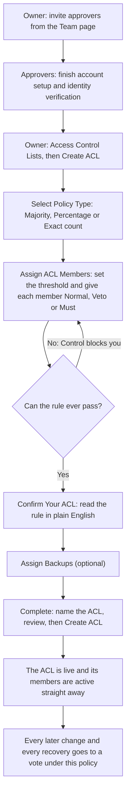

An Access Control List (ACL) is the group of named people authorised to approve the recovery of the backups it protects, and to approve any change to who is on the list. You decide how many of them must agree by choosing an **approval policy** when you create the ACL.

Changing who's on an ACL isn't an administrative action. The people already on the list vote on it, under the same policy. That's what ensures nobody outside the list, whether one of your own administrators or CoinCover, can quietly change who is able to release your material.

## At a glance

|  |  |
| --- | --- |
| **Scope** | One ACL can protect many backups. Each backup is protected by one ACL. |
| **Approval policy** | **Majority**, **Percentage** or **Exact count**, chosen when you create the ACL |
| **Member roles** | **Normal**, **Veto** or **Must approve**. A member can be both Veto and Must approve. |
| **Minimum size** | One member, as long as the policy can always be met by the members you add |
| **Who creates an ACL** | An Organisation Owner |
| **Who approves a change or a recovery** | The ACL's members, under its policy |
| **Voting window** | Set for your organisation. Seven days by default. |
| **Verification of Vote** | Each member's identity is verified at the point of voting, with an optional hardware security key for added assurance. |

## Approval policies

The policy sets the **threshold**: how many approvals a vote needs. It applies to every vote the ACL holds, both recovery requests for its backups and changes to its own membership.

| Policy | How the threshold is worked out | 3 members | 4 members | 5 members |
| --- | --- | --- | --- | --- |
| **Majority** | More than half of the members | 2 | 3 | 3 |
| **Percentage** (example: 60%) | That share of the members, always rounded up | 2 | 3 | 3 |
| **Exact count** (example: 2) | The number you set, however many members there are | 2 | 2 | 2 |

Some worked examples:

- **Majority with 4 members** needs 3 approvals. Half of 4 is 2, and the policy needs more than half.
- **Percentage at 51% with 4 members** needs 3 approvals. 51% of 4 is 2.04, which rounds up to 3.
- **Percentage at 75% with 6 members** needs 5 approvals. 75% of 6 is 4.5, which rounds up to 5.
- **Percentage at 10% with 5 members** needs 1 approval. Any percentage always needs at least one, and Control warns you when your percentage rounds down to a one-person rule.
- **Exact count of 2 with 5 members** needs 2 approvals. If the ACL later grows to 8 members, it still needs 2.

<Note>
  Majority and Percentage thresholds follow the ACL's current size. If members are added or removed later, the number of approvals needed changes with them. An Exact count threshold stays the same.
</Note>

### Rejections use the same threshold

A vote is declined as soon as the number of rejections reaches the threshold. With an **Exact count of 2 out of 5**, two rejections decline the request, even if the other three members would have approved. A low threshold makes approval easy, and it makes rejection just as easy.

If everyone who can vote has voted and neither approvals nor rejections reached the threshold, the request is declined.

## Member roles

Each member has one of these roles, chosen as you add them:

| Role | What it means |
| --- | --- |
| **Normal** | Their vote counts toward the threshold like everyone else's. |
| **Veto** | Their rejection declines the request on its own, whatever anyone else has voted. Their approval counts toward the threshold like a Normal member's. |
| **Must approve** | The request can't be approved without their approval, even when the threshold is met. Their approval also counts toward the threshold. |

A member can be both **Veto** and **Must approve**. Their rejection declines the request straight away, and nothing passes without their approval.

### How the outcome is decided

Control checks a vote in this order every time someone votes:

1. **Voting window.** If the window has closed, the request expires and nothing is applied, whatever votes came in.
2. **Veto.** If any Veto member has rejected, the request is declined straight away. This applies even if a Must-approve member has approved.
3. **Threshold.** If approvals reach the threshold, the request is approved, subject to step 4. If rejections reach the threshold, it's declined. If everyone has voted and neither side reached it, it's declined.
4. **Must approve.** If the threshold is met but a Must-approve member hasn't approved yet, the request stays open for them. If a Must-approve member rejected, the request can't pass, and it's declined once everyone has voted or when the window closes.

A vote only counts once that member's verification has been completed.

#### Worked example

An ACL of five members uses **Majority**, so it needs 3 approvals. Alex is **Must approve** and Bea is **Veto**. Chris, Dana and Eli are **Normal**.

| What happens | Outcome |
| --- | --- |
| Chris, Dana and Eli approve | Threshold met, but Alex hasn't approved. The request stays open. |
| ...then Alex approves | **Approved** |
| Alex and Chris approve, then Bea rejects | **Declined** straight away. Bea vetoed it. |
| Alex rejects; Chris, Dana and Eli approve | Can't pass without Alex. **Declined** once Bea has voted too, or when the window closes. |
| Chris and Dana reject | Still open: 2 rejections is below the threshold of 3. |
| Chris, Dana and Eli reject | **Declined**. Rejections reached the threshold. |

## Create an ACL

Here is the whole setup, from inviting approvers to the first vote. Every step is done by your organisation. CoinCover doesn't take part in creating an ACL.

<Steps>
  <Step title="Onboard your approvers">
    Everyone you want on the ACL first needs a Control account. Invite them from the **Team** page and have them complete account setup and identity verification. Only active users of your organisation can be added to an ACL, and members need a completed identity check before they can vote.
  </Step>
  <Step title="Start creating the ACL">
    As an Organisation Owner, go to **Access Control Lists** and select **Create ACL**.
  </Step>
  <Step title="Select a policy type">
    On **Select Policy Type**, choose **Majority**, **Percentage** or **Exact count**. See [Approval policies](#approval-policies) for how each one works.
  </Step>
  <Step title="Assign members and roles">
    On **Assign ACL Members**, set the threshold if your policy needs one: the percentage for **Percentage**, or the number of approvals for **Exact count**. Then add each member by choosing their role: **Normal**, **Veto** or **Must**. Choosing a role adds the person. Selecting **Normal** again on a Normal member takes them off the list.

    The panel beside the list shows **The rule, in plain English**, for example "At least 3 of 5 members must approve", and names each Veto and Must-approve member. You can't continue while the rule could never pass. For example, an Exact count of 4 with only 3 members is blocked.
  </Step>
  <Step title="Confirm the rule">
    On **Confirm Your ACL**, check the rule reads the way you intend, then select **Confirm & continue**. Control points out anything worth a second look, such as Must-approve members who already decide every outcome on their own, or a percentage that rounds down to a single approval.
  </Step>
  <Step title="Assign backups">
    On **Assign Backups**, choose the backups this ACL protects. Recovering any of them will need this policy. Backups that already have an ACL show as **Already assigned** and can't be selected. This step is optional: you can assign backups later.
  </Step>
  <Step title="Name, review and create">
    On **Complete**, give the ACL a name under **Name this ACL**, review the members and backups, then select **Create ACL**. The members you added are active straight away. No vote is needed to set up the list.
  </Step>
</Steps>

<Warning>
  **You can't change the policy after the ACL is created.** The policy type and threshold are fixed. Check the rule carefully on the **Confirm Your ACL** and **Complete** steps. A backup stays with the ACL it's first assigned to: Control doesn't let you move it to a different ACL, so get the policy right before you assign backups.
</Warning>

If one or more backups couldn't be attached, Control still creates the ACL and tells you how many failed. You can assign them afterwards with **Assign to backup** on the ACL's page, or **Assign ACL** on the backup's page.

### Choosing a size and threshold

- **One member is allowed.** It means that one person approves every recovery and every change on their own.
- **Leave headroom.** The person being removed or replaced doesn't vote on their own change, but the threshold is still counted against everyone currently on the list. If your policy needs every member's approval, for example an Exact count equal to the number of members, 100%, or Majority with two members, Control won't let you remove anyone.
- **Plan for absence.** A recovery is often urgent. Pick a threshold your approvers can still meet when someone is away or unreachable, and use **Must approve** sparingly, since it makes that person essential to every vote.

## Change who's on an ACL

Once the ACL exists, adding, removing or replacing a member is proposed and then voted on under the ACL's policy.

<Steps>
  <Step title="Propose the change">
    Open the ACL from **Access Control Lists** and propose adding, removing or replacing a member. Members are added one at a time, each with its own vote. When you add someone you can give them the **Veto** or **Mandatory approver** role. **Mandatory approver** is the same as **Must approve**.
  </Step>
  <Step title="The members vote">
    Everyone currently on the ACL is asked to approve or reject, and each verifies their identity as they vote. The person being removed or replaced doesn't vote on their own change.
  </Step>
  <Step title="The change takes effect">
    Once the vote passes under the ACL's policy, the change is applied. If it's declined or the voting window closes first, nothing changes. See [Approve or reject an ACL change](/guides/control/approve-list-change) for the voter's side.
  </Step>
</Steps>

For example, on a **Majority** ACL of four members (3 approvals needed), removing one member leaves three people who can vote, so all three must approve.

<Note>
  Control blocks a removal when the members left to vote on it couldn't reach the threshold. Because the policy can't be edited, add a member first, or keep the member.
</Note>

## Good to know

- **The voting window.** Each vote stays open for your organisation's voting window, which is seven days by default. A vote that isn't decided when the window closes expires, and nothing is applied.
- **One change at a time.** Finish or cancel a pending change before proposing another.
- **ACLs are frozen during a recovery.** An ACL can't be edited while a recovery is running on one of its backups, and a recovery can't be started while a change to its ACL is in progress. Plan membership changes outside recovery windows.
- **Remove people from the ACL before the organisation.** Control won't remove a person from your organisation while they're still on any Access Control List, so take them off their ACLs first.

## What's next

<CardGroup cols={2}>
  <Card title="Approve or reject an ACL change" icon="user-check" href="/guides/control/approve-list-change">
    The voter's side of a membership change.
  </Card>

  <Card title="Recover key material" icon="key" href="/guides/control/recover-key-material">
    Use the ACL to approve a recovery.
  </Card>

  <Card title="Get started" icon="circle-play" href="/guides/control/get-started">
    Onboard the people who'll be on your ACLs.
  </Card>
</CardGroup>
