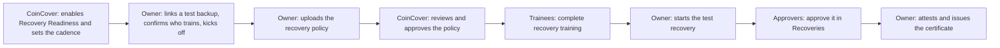

Recovery Readiness is a guided check in CoinCover Control that takes your organisation from a written recovery policy to a rehearsed recovery. CoinCover reviews your recovery policy, the people who approve recoveries complete recovery training, and your team runs a test recovery with the same approvals and identity checks as a real one. When every step is done, Control issues a Recovery Readiness certificate, digitally signed by CoinCover, that records what was done, by whom and when.

Everything runs on a **test copy of your backup** on a test network (Testnet). No production keys are touched at any point.

## At a glance

| | |
|---|---|
| **Who switches it on** | CoinCover, for your organisation. Speak to your CoinCover contact if you'd like it enabled. |
| **Who runs it** | Your organisation owner sets it up, uploads the policy, starts the test recovery and confirms the result. |
| **Who takes part** | Everyone on the test backup's Access Control List (ACL) trains and approves the test recovery. The owner can add other people to the training. |
| **How often** | Every 3 or 6 months. CoinCover sets the cadence with you. |
| **What you get** | A Recovery Readiness certificate for your organisation, and a participation record for each person who trained. |
| **Where** | **Recovery Readiness** in the Control sidebar, once it's enabled for your organisation. |

## How it works

## Before you start

- **Recovery Readiness is enabled for your organisation.** CoinCover switches it on and sets how often the check runs. You'll then see **Recovery Readiness** in the sidebar.
- **A test backup.** The check runs on a test copy of your backup, never your production backup. If you don't have one, you can request it from CoinCover during setup.
- **An Access Control List on the test backup.** The people on the test backup's ACL are the approvers for the test recovery, and they must all complete training. The ACL needs to be approved, with no changes waiting for a vote. See [Set up your Access Control List](/guides/control/approval-control-list).
- **A GPG key pair you control**, for the test recovery. See [Create a GPG key pair](/guides/control/create-gpg-key).

## Set up and kick off

The organisation owner does this from **Recovery Readiness** in the sidebar.

<Steps>
  <Step title="Link a test backup">
    Under **Test backup**, select your test backup. If you don't have one yet, request one from CoinCover. We'll provision it, and you'll get a notification in Control when it's ready to link.
  </Step>
  <Step title="Check your approvers">
    Under **Access control list**, you'll see the approvers on the test backup's ACL. These are the people who will approve the test recovery. To change who's on it, select **Edit the access control list** and change the list on that backup. Changes go to a vote of the current members, as usual.
  </Step>
  <Step title="Choose who trains">
    Under **Who trains**, everyone who approves is already included and can't be removed. Tick anyone else in your organisation who should train too. CoinCover may also ask that all organisation owners train.
  </Step>
  <Step title="Kick off">
    Select **Kick off readiness check**. Everyone who needs to train is assigned the training, and you can upload your recovery policy.
  </Step>
</Steps>

<Warning>
  Once you kick off, the setup is locked for this check. You can't change the test backup or the list of people who train. Check both before you kick off.
</Warning>

## Submit your recovery policy

Your recovery policy is your organisation's written instructions for running a recovery: who does what, in what order, and with what tools. It's separate from the approval rules on your ACL.

<Steps>
  <Step title="Upload the policy">
    In **Submit recovery policy**, upload your policy as a PDF of up to 20 MB.
  </Step>
  <Step title="CoinCover reviews it">
    We review the document in Control, add comments to it, and either approve it or ask for changes. You're notified by email when the review starts and when it's finished.
  </Step>
  <Step title="If we ask for changes">
    Open the feedback to read our comments on the document. You can reply to a comment if something needs discussing. Then upload a revised policy as a new version. Uploading the same file again is rejected.
  </Step>
</Steps>

Every version is kept in **Version history**. While a version is with CoinCover for review you can't upload another. If you upload a new version after your policy has been approved, it replaces the approved one and goes through review again, and training and the test recovery wait until the new version is approved.

## Complete the training

Training opens once your policy is approved. Everyone on the training list is notified in Control and completes CoinCover's recovery training on the **Recovery training** page. It takes about 20 minutes and is recorded for each person. Approvers and other members see their tasks under **Your readiness tasks**.

## Run the test recovery

The test recovery opens once the policy is approved and everyone has completed training.

<Steps>
  <Step title="Start the test recovery">
    The owner selects **Start Recovery** and provides a GPG public key. The test backup and its packages are selected automatically.
  </Step>
  <Step title="Approvers approve it">
    Each approver opens the request in **Recoveries** and approves it exactly as they would a real recovery, including a fresh identity check and, if your organisation uses them, a security key. See [Approve or reject a recovery request](/guides/control/approve-recovery-request).
  </Step>
  <Step title="The test recovery completes">
    The test recovery is complete once the test backup's ACL has approved it. The recovered test package is encrypted to the GPG key you provided. You can download it once, within 7 days.
  </Step>
</Steps>

<Note>
  The emails for a test recovery look the same as for a real recovery. To tell them apart, check the backup name in the email and, in Control, the **Testnet** badge at the bottom right of the screen. If an approver can't find the request, they should open it from the link in the email or notification, which takes them to the test environment.
</Note>

## Issue your certificate

When the policy is approved, everyone has trained and the test recovery is complete, the owner selects **Attest & issue certificate** to confirm the test recovery succeeded. Control issues the certificates, which can take up to half a minute. Only the organisation owner can attest. CoinCover can't attest on your behalf.

The dashboard then shows your organisation as **Certified**, along with your past checks and when the next check is due. When your next check is due, contact CoinCover to arrange it.

## Your certificate

The Recovery Readiness certificate records:

- your organisation, custody provider and the test backup it covers
- the test recovery, its reference and the date it completed
- the reviewed recovery policy: version, outcome, reviewer and date
- the people who trained, their roles and when they trained
- who attested, the issue date, and when the next check is due

It's digitally signed by CoinCover and labelled as a Testnet drill. It records that your recovery process was rehearsed on a given date. It doesn't show that you can access or move your assets, and it isn't financial, legal or audit advice.

The certificate doesn't expire. It's a record of a check completed on a specific date, and it shows when your next check is due.

**Downloads.** The owner selects **Download certificate** for the organisation certificate. Each person who trained can select **Download my record** for their own participation record, which shows their role, their training and how they responded to the test recovery. Downloads open in a new browser tab, so allow pop-ups for Control.

## Give your auditor access

Once a certificate has been issued, the organisation owner can give an auditor read access to its attestation record from the **Auditor access** panel on the Recovery Readiness dashboard.

<Steps>
  <Step title="Check the auditor has a Control account">
    Your auditor needs their own CoinCover Control account. Access is linked to that account, so use the email address they sign in with.
  </Step>
  <Step title="Grant access">
    Enter their email in **Auditor email** and select **Grant access**. The grant appears in the list as **Active**, with who granted it and when.
  </Step>
  <Step title="Revoke access when it's no longer needed">
    Select **Revoke** next to the grant. It takes effect straight away, and the grant stays in the list as **Revoked**.
  </Step>
</Steps>

Auditor access is read-only. It covers the signed attestation record of your certificates, including the names and email addresses of the people recorded on them. It doesn't give access to your policy, training or recoveries. Grants don't expire, so revoke them when an audit ends. Contact CoinCover to arrange how your auditor reviews the attestation record.

## Who can do what

| Task | Who |
|---|---|
| Enable Recovery Readiness and set the cadence | CoinCover |
| Link the test backup, choose who trains, kick off | Organisation owner |
| Upload and update the recovery policy | Organisation owner |
| Review and approve the recovery policy | CoinCover |
| Complete training | Everyone on the training list |
| Start the test recovery | Organisation owner |
| Approve the test recovery | Members of the test backup's ACL |
| Attest and issue the certificate | Organisation owner |
| Download the organisation certificate | Organisation owner |
| Download a participation record | Each person who trained, for their own record |
| Grant and revoke auditor access | Organisation owner |

## Common questions

<AccordionGroup>
  <Accordion title="Does Recovery Readiness touch our production keys?">
    No. Everything runs on a test copy of your backup on a test network.
  </Accordion>
  <Accordion title="I can't see Recovery Readiness in Control">
    It's switched on for each organisation by CoinCover. Speak to your CoinCover contact.
  </Accordion>
  <Accordion title="Can we change our approvers or trainees after kick-off?">
    Not for the current check. Setup is locked at kick-off. Contact CoinCover if something needs to change.
  </Accordion>
  <Accordion title="Can we choose how often the check runs?">
    CoinCover sets the cadence with you: every 3 months or every 6 months.
  </Accordion>
  <Accordion title="Can someone verify our certificate online?">
    Online verification isn't available. Your certificate is digitally signed by CoinCover. If your auditor or another party needs to confirm a certificate is genuine, contact CoinCover.
  </Accordion>
  <Accordion title="Is the certificate a compliance certification?">
    No. It records a completed recovery drill on a specific date. It isn't a compliance certification, and it isn't financial, legal or audit advice.
  </Accordion>
</AccordionGroup>

## What's next

<CardGroup cols={2}>
  <Card title="Set up your Access Control List" icon="user-shield" href="/guides/control/approval-control-list">
    The approvers the test recovery depends on.
  </Card>

  <Card title="Approve a recovery request" icon="circle-check" href="/guides/control/approve-recovery-request">
    How approvers vote, for real and test recoveries.
  </Card>

  <Card title="Create a GPG key" icon="lock" href="/guides/control/create-gpg-key">
    The key the test recovery package is encrypted to.
  </Card>

  <Card title="Recover key material" icon="key" href="/guides/control/recover-key-material">
    How a real recovery runs.
  </Card>
</CardGroup>
